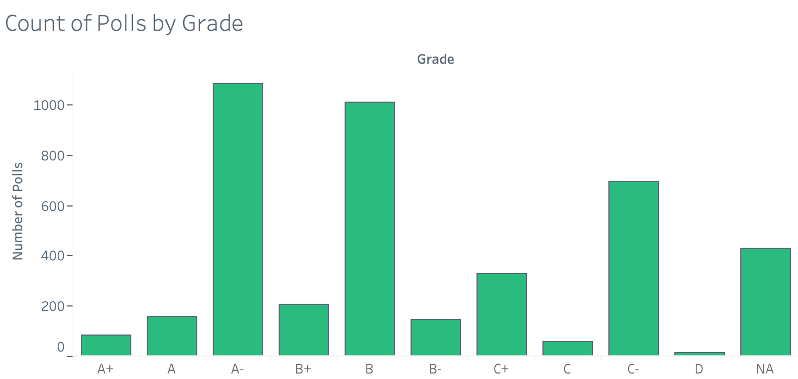
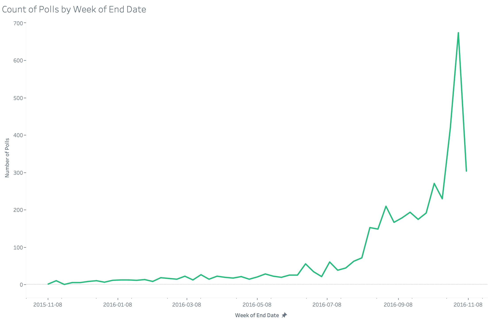
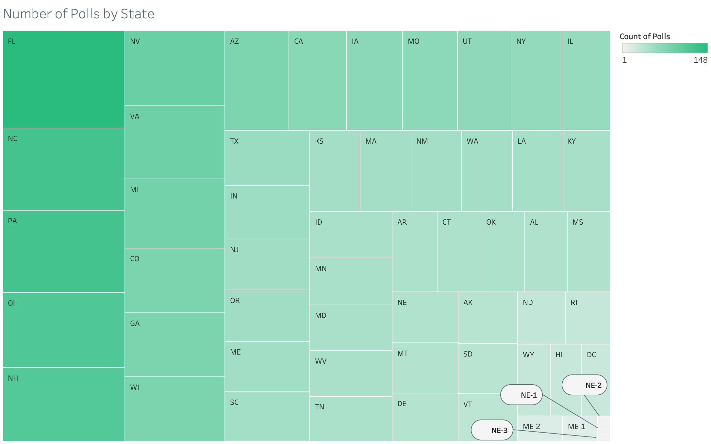
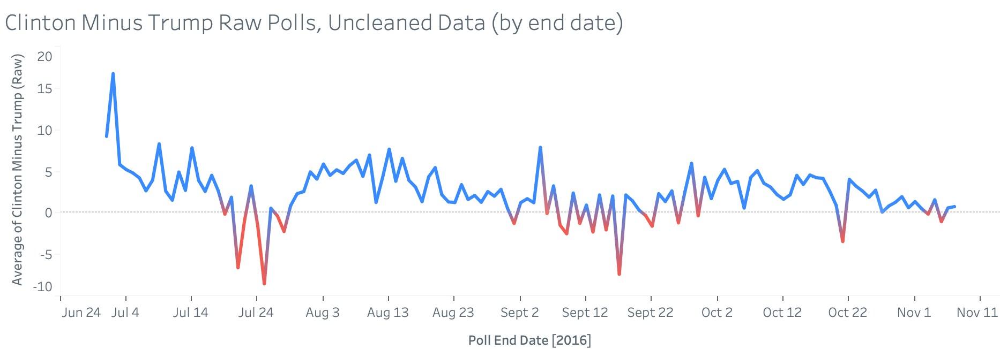
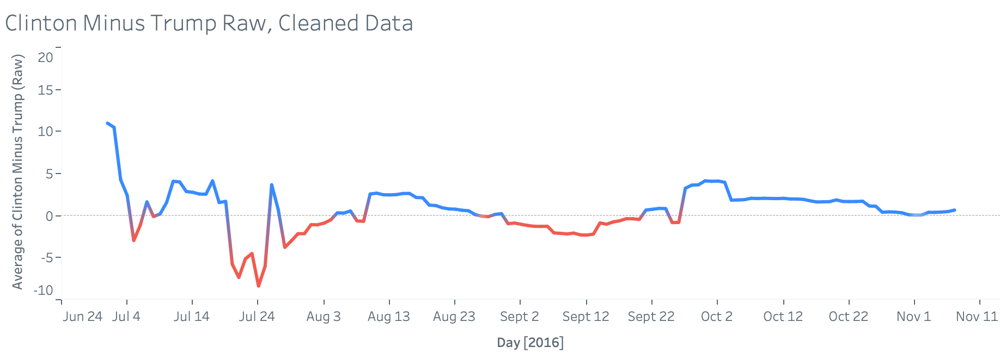
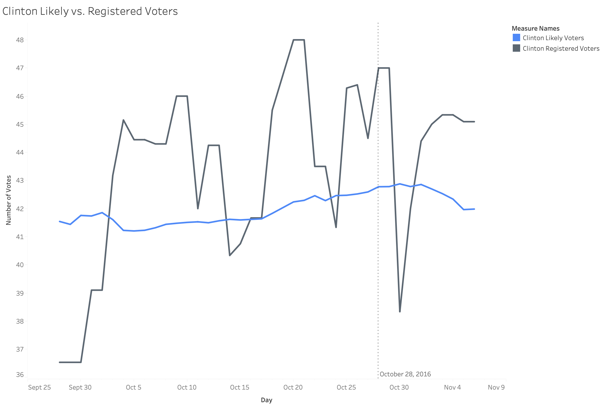
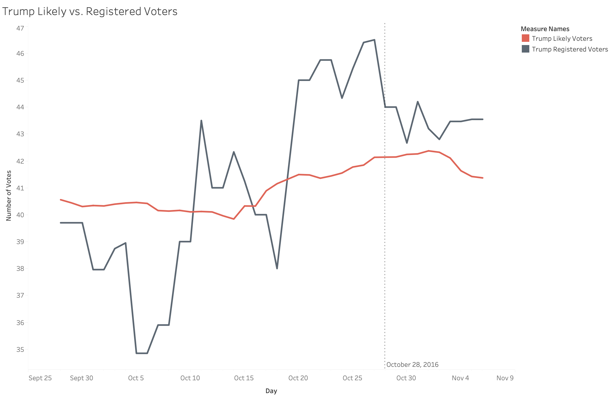
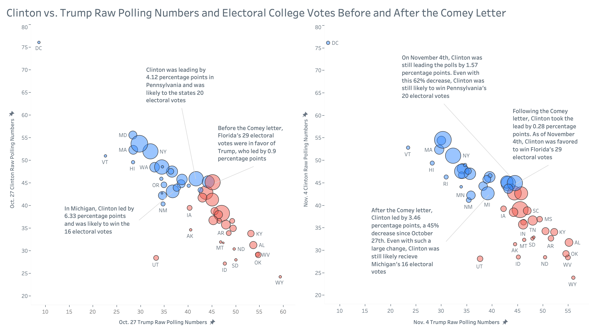
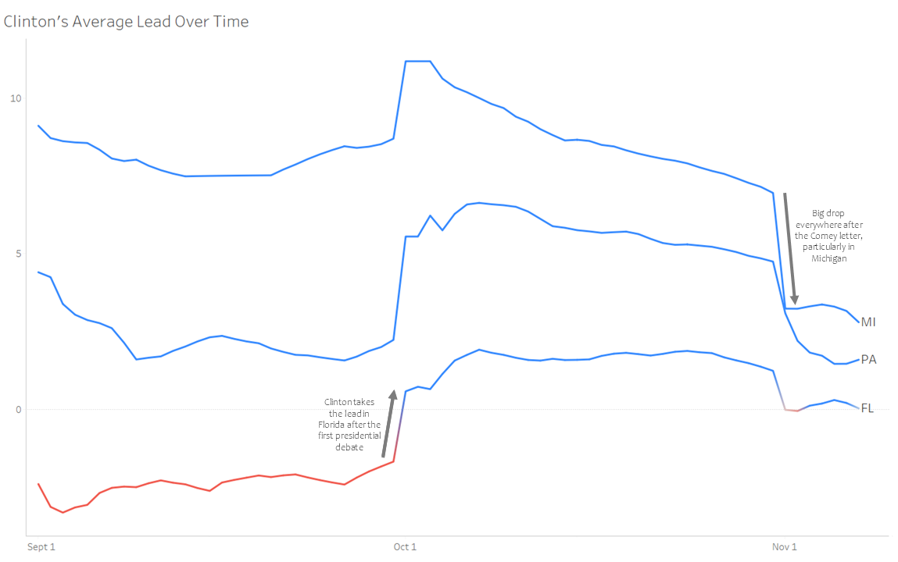
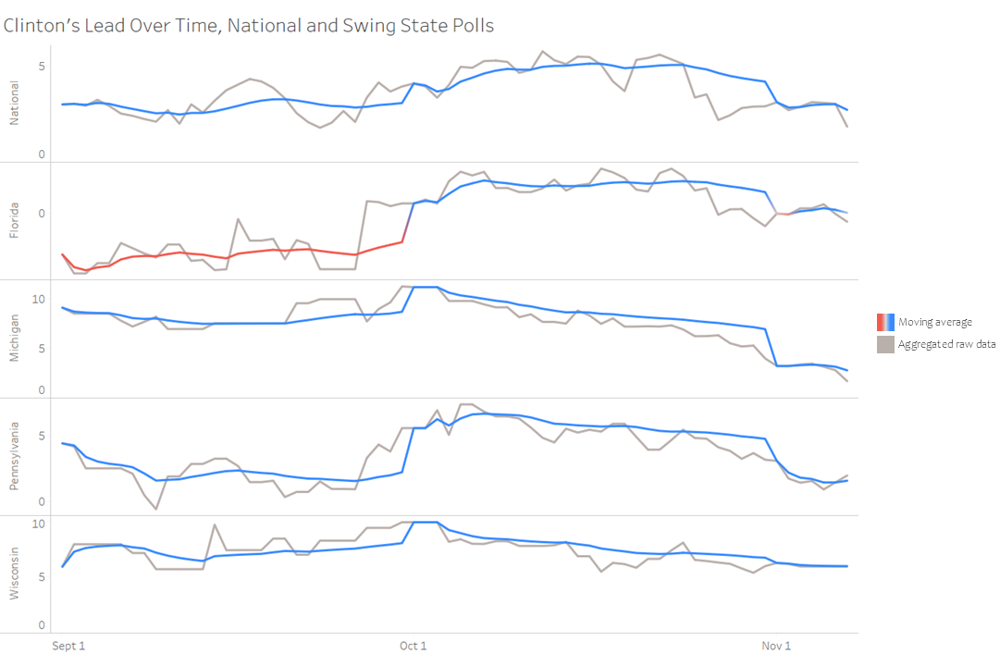

# First Past the Post: Comey’s Letter and the Electoral College in the 2016 U.S. Presidential Election

## Introduction

Hillary Clinton's loss to Donald Trump in the 2016 American presidential election was as unexpected as it was humiliating. How did a former Senator, First Lady, and Secretary of State[^1] lose to a washed-up reality TV star who, just a month before the election, made headlines for a resurfaced video in which he bragged about sexual assault[^2]?

Clinton has attributed much of the blame for her defeat to former FBI Director James Comey[^1]. On October 28, 2016, Comey sent a letter to Congress outlining the FBI's decision to reopen an investigation into Clinton's use of a private email server[^3]. The ensuing media circus dominated the news cycle during the final stretch of the campaign. Two days before the election, on November 6th, Comey announced that the new evidence did not warrant reopening the investigation after all[^4].

Given how things turned out, it's understandable that Clinton feels Comey sabotaged her. This investigation will explore whether there is evidence for the existence of "the Comey effect". It will also provide a comprehensive overview of polling methodology and the American electoral system. Readers are invited to consider ethical questions about the role of government officials and the media in ensuring free and fair elections.

## Understanding the Data
	
The data used for this data visualization project was a flat data file in comma separated value format. The columns are given and explained in the data dictionary table below. For each column, the data dictionary states its data type, if it has null values (and how many), a description of what the variable represents, and its use in our analysis.

| Column Name      | Data Type  | Has Nulls (y/n) | Description                                                                 | Justification                                                                                                                                      |
|------------------|------------|-----------------|-----------------------------------------------------------------------------|---------------------------------------------------------------------------------------------------------------------------------------------------|
| state            | character  | no              | The geographical location in which the poll was conducted                   | This variable is crucial in helping us understand the dataset because it allows us to know where the poll took place. Good for geographic analysis. |
| startdate        | date       | no              | The starting date of the poll.                                              | This variable allows us to perform time series analysis on the dataset.                                                                            |
| enddate          | date       | no              | The end date of the poll.                                                   | This variable allows us to perform time series analysis on the dataset.                                                                            |
| pollster         | character  | no              | The organization that conducted the poll.                                   | This helps understand what each row represents: A poll done by a pollster.                                                                         |
| population       | categorical| no              | The sample population of the poll.                                          | This describes the sample population of each poll, important for understanding the data context.                                                   |
| samplesize       | integer    | yes (1 NA)      | The sample size of the poll.                                                | Describes the sample size of each poll, crucial for understanding the reliability of poll results.                                                 |
| grade            | categorical| yes (429 NA)    | Fivethirtyeight's pollster rating, determined by their predictive plus-minus.[^5]| Shows pollster quality, giving insight into the reliability of poll results.                                                                       |
| rawpoll_clinton  | float      | no              | The raw poll result for Clinton.                                            | Important for analyzing polling results for each presidential candidate.                                                                           |
| rawpoll_trump    | float      | no              | The raw poll result for Trump.                                              | Important for analyzing polling results for each presidential candidate.                                                                           |
| rawpoll_johnson  | float      | yes (1409 NA)   | The raw poll for Johnson.                                                   | Important for understanding the broader polling context, but not used in the Trump vs Clinton analysis.                                            |
| rawpoll_mcmullin | float      | yes (4178 NA)   | The raw poll for McMullin.                                                  | Important for understanding the broader polling context, but not used in the Trump vs Clinton analysis.                                            |
| adjpoll_clinton  | float      | no              | The adjusted poll results for Clinton.                                      | Important for analyzing polling results for each presidential candidate.                                                                           |
| adjpoll_trump    | float      | no              | The adjusted poll results for Trump.                                        | Important for analyzing polling results for each presidential candidate.                                                                           |
| adjpoll_johnson  | float      | yes (1409 NA)   | The adjusted poll results for Johnson.                                      | Important for understanding the broader polling context, but not used in the Trump vs Clinton analysis.                                            |
| adjpoll_mcmullin | float      | yes (4178 NA)   | The adjusted poll results for McMullin.                                     | Important for understanding the broader polling context, but not used in the Trump vs Clinton analysis.                                            |

This dataset contains information about poll results in the United States of America’s 2016 presidential election. It appears that the data we used is a subset of polling data (including only the observations with type “polls-only”) published by [fivethirtyeight](https://projects.fivethirtyeight.com/general-model/president_general_polls_2016.csv). 

Each row of the dataset represents a poll done by a specified pollster. For each row, the following variables are given: state, start date, end date, pollster, population, sample size, grade, and both raw and adjusted poll numbers for each presidential candidate. 

We will be exploring how, if at all, the Comey letter, affected the outcome of the polls. We focused primarily on Donald Trump and Hillary Clinton’s polling results, and therefore removed the columns rawpoll_johnson, adjpoll_johnson, rawpoll_mcmullin, and adjpoll_mcmullin from our data. Indeed, as seen in the data dictionary, Evan McMullin and Gary Johnson do not appear in 4,178  and 1,408 polling results, respectively.

Variables specific to the quality of the poll data, such as sample size, grade, and state, were analyzed in an attempt to understand their effect on polling results. Fivethirtyeight.com’s methodology was also used with the goal of using the highest quality data in further analysis.

The above bar chart displays the distribution of the polls by grade. As mentioned in our data dictionary, the grade column refers to fivethirtyeight’s pollster rating, calculated with the use of their predictive plus-minus metric[^5]. This could indicate that taking observations with better grades can produce higher quality results in our future analyses, although there are many observations with a grade of C- and NA, so relying on only higher grades could exclude too much data.

The following line graph displays the number of polls by the week of their completion. It is clear that as the date of the election in 2016 approaches, the amount of polls being completed increases as well, with a large spike the week before the election. In our further analysis, we generally only select the timeline of September 2016 to November 2016.

The following visualization is a box and whisker plot of the sample size variable. The median sample size of all polls in the dataset is 1,046. There are many outliers. Most notably, there are two polls with a sample size of about 70,000 and 85,000. In our analysis, we removed all observations where the sample size was greater than 5,000 to remain consistent with fivethirtyeight.com’s methodology[^6]. This, and other data cleaning and preparation techniques will be discussed in the following section of this report. 

.png)

The following treemap shows the distribution of polls by state in the uncleaned dataset. Further  in our analysis, we explore the swing states of the 2016 presidential election, specifically Florida, Michigan, Pennsylvania, and Wisconsin. As we can see in the treemap, Florida appears the most often in our uncleaned poll dataset, while Pennsylvania is the third most common. Michigan and Wisconsin also appear in the polls quite often relative to many of the other states. This means that there are many polls taken in the swing states we are interested in, which is a good sign for the quality of our analyses. 

## Data Cleaning and Preparation Methodology

Our data cleaning and preparation process is derived from that of fivethirtyeight.com’s methodology in 2023. Fivethirtyeight.com limits their sample to polls with a sample size of no more than 5,000, and use median sample sizes to replace missing ones[^6]. They also use sample size weighing for weighing polls with different sample sizes differently[^6].  

We mimicked their approach in order to have the best quality data when doing further visualizations while ensuring consistency with our source. As previously mentioned, we dropped Gary Johnson and Evan McMullin’s polling results as they won’t be necessary for our analysis. We then replaced any missing values in the samplesize column, with either the median sample size of all polls by that pollster, or if not available, the median sample size of all polls. In the case of our dataset, there is only one poll missing a sample size and it is replaced by the median sample size over all polls. Finally, we took only observations with a sample size of less than 5,000, which follows fivethirtyeight.com’s methodology[^6]. 

The given format of the dates are one column with the start date of the poll, and one column with the end date of the poll. We wanted to have the polling numbers for Trump and Clinton for each day, so we split the data to individual days. First, if two of the same “polls”  (They have the same pollster, the same state, the same population and the same grade) were overlapping in dates, we cut off the first one to end a day before the next one starts. Before the next step, it is important to note that we only used polls from the dataset with the population equal to “lv”, or likely voters, as this is what fivethirtyeight.com favors[^6]. Next, we split the poll date values into individual days. For each “poll” as described above, we copied the row for each day in the date range from start date to end date. For example, if a poll has startdate 2016-01-01 and enddate 2016-01-07, there will now be seven rows, with a new day column labeled 2016-01-01, 2016-01-02, 2016-01-03,..., 2016-01-07 respectively. 

Finally, in our analysis, we used the metrics Clinton minus Trump (C Minus T) with the raw poll data, and Clinton minus Trump with the adjusted poll data. We calculated such variables as Clinton's polls minus Trump's polls, however we also weighted them based on sample size. The weights for the weighted average are calculated as the square root of the poll’s sample size, divided by the square root of the median sample size for the group of polls (grouped by day and state), which is the same formula that fivethirtyeight.com uses[^6]. 

The figures below are displayed with the intention of exploring how these data cleaning techniques have changed the time series of Clinton’s polls minus Trump’s polls (C Minus T). They show Clinton minus Trump’s polling number over time from July to the election in November. This range was chosen to illustrate the difference in raw versus cleaned data. It is interesting to note that two different extreme points have leveled out between mid August and mid October, while two extreme  points around July 24 are similarly visible in both the uncleaned and cleaned data. 

## Registered Voters vs. Likely Voters

Throughout this article, we have treated polling data as a fixed set of values. In reality, however, there are multiple ways to assess voter preferences, and the choice of metric can significantly affect the conclusions drawn. So, what leads political scientists to prefer one measure over another?

In the figures below, we compare data from Registered Voters (RV) and Likely Voters (LV). As the names suggest, registered voters are those who have formally registered to cast a vote, whereas likely voters are individuals who have expressed a strong intention to vote, typically gauged through polling questions about engagement and voting behavior. These two groups can behave quite differently, which is reflected in their responses to political events.

One such theme is the greater volatility observed in the Registered Voter group. This volatility introduces noise when trying to derive statistical insights, which is why, for our analysis, we chose to focus on the less volatile Likely Voter group. Since many of the trends we are investigating occur at a macro level, the relative stability of likely voters offers a clearer view of long-term trends. Nevertheless, both groups provide valuable insights into voter behavior and sentiment.

To illustrate, consider the effect of the Comey letter, released on October 28th. As shown in the figures, there was an immediate drop in support for Clinton among registered voters, yet the shift among likely voters occurred more gradually, taking a few weeks to reflect the same trend. This delay suggests that while the news immediately swayed the pool of registered voters, likely voters took longer to shift their support. Perhaps simply due to the trickle of information into the voter base as the severity of the letter became more evident. 

Another interesting observation is the relatively small reaction to the Comey letter among Trump’s registered voters. Despite the letter’s impact on Clinton’s numbers, we do not see a corresponding surge in Trump’s RV base. However, there was a noticeable uptick in likely voters favoring Trump, suggesting that moderates, or those undecided, were swayed towards Trump as Clinton faced increased media scrutiny. 

This divergence between RV and LV data highlights the importance of choosing the right voter metric when interpreting polling results. While registered voters provide a snapshot of broader public opinion, likely voters offer a more precise forecast of election outcomes, particularly in volatile political environments.

## Influence on the Electoral College

While looking at the overall public's opinion through polls, we must remember that the United States of America is not a democracy of majority. Instead, voters are casting ballots for electors in their state that represent a candidate and a congressional seat. The number of electors per state is determined by population and representation in Congress. For example, Florida has 29 electors, whereas Pennsylvania and Michigan have 20 and 16, respectively. A candidate, in this case Hillary Clinton or Donald Trump, needs 270 electoral votes to win. Therefore, it is necessary when analyzing  poll data that we include the designated electoral votes to get a more accurate estimate of how the election will play out.

Below is a bubble graph showing where the electoral votes laid on October 27th, before the Comey letter was released, and November 4th, a week after the letter was released.

On October 27th, Trump was ahead of Clinton in electoral votes, leading 292 to 241 (Note that this only accounts for 533 of 538 electoral votes. For consistency, only states that appeared in polls on both days were included in this chart). Following the letter's release, we see an increase in bubbles in the bottom right of the November 4th graph, indicating these states were favoring Trump more decisively.  This is confirmed by electoral votes, with Clinton dropping to 201, and Trump increasing to 332. 

## Swing States

Below is an exploration of aggregated raw polling data, along with a moving average, for national polls and several swing states. These states had some of the closest margins in the country; while Clinton was predicted to win most of them, Trump ultimately secured victories across the board[^7]. It is worth noting that all of these states voted for Barack Obama in 2012[^8] and Joe Biden in 2020[^9]. A noticeable drop in the polls' moving average after October 31st is evident in the national polls and in all the listed states except Wisconsin.

Here, we have a direct comparison of the weighted average polls from Florida, Michigan, and Pennsylvania. In all cases, there was a noticeable increase after the first presidential debate, and a decrease after Comey's letter. In terms of electoral college votes, Florida alone would've been sufficient for Clinton to win. This is not a new phenomenon; in 2000, 537 Florida votes decided George Bush's victory over Al Gore[^10].

## Conclusion

In his memoir, Comey was "sure Clinton would win [^11]". If there is one thing that should be taken away from this investigation, it is that election results are not guaranteed until the votes have been counted. Polls are not a crystal ball, particularly in the context of the American electoral college. More specifically, election outcomes are not determined by the popular vote, but by 538 elected officials in a process where some votes matter more than others. In hindsight, Trump’s victory within the current electoral framework should not have been a surprise. It would be misleading to point to the timing of the Comey letter as the only variable that determined the election outcome, but our visualizations do seem to indicate a moderate impact. With the 2024 presidential election right around the corner, we urge government officials and media organizations to exercise care in their disclosure and coverage of stories that could influence the electorate.

## References
[^1]: Clinton, H. R. (2017). What Happened. Simon and Schuster. 

[^2]: [Fahrenthold, D. A. (2016, October 8). *Trump recorded having extremely lewd conversation about women in 2005.* The Washington Post.](https://www.washingtonpost.com/politics/trump-recorded-having-extremely-lewd-conversation-about-women-in-2005/2016/10/07/3b9ce776-8cb4-11e6-bf8a-3d26847eeed4_story.html)

[^3]: [*Letter to Congress From F.B.I. Director on Clinton Email Case.* (2018, May 10). The New York Times. ](https://www.nytimes.com/interactive/2016/10/28/us/politics/fbi-letter.html)

[^4]: [Apuzzo, M., Schmit, M. S., & Goldman, A. (2016, November 6). *Emails Warrant No New Action Against Hillary Clinton, F.B.I. Director Says.* The New York Times.](https://www.nytimes.com/2016/11/07/us/politics/hilary-clinton-male-voters-donald-trump.html)

[^5]: [*How Our Pollster Ratings Work.* (2023, March 10). FiveThirtyEight.](https://fivethirtyeight.com/methodology/how-our-pollster-ratings-work/)

[^6]: [Morris, G.E. (2023, July 26). *How Our Polling Averages Work.* FiveThirtyEight.](https://fivethirtyeight.com/methodology/how-our-polling-averages-work/)

[^7]: [*2016 Presidential Election Results.* (2017, August 9). The New York Times.](https://www.nytimes.com/elections/2016/results/president)

[^8]: [*President - Live Election Results -  NYTimes.com.* (2012, November 29). The New York Times.](https://www.nytimes.com/elections/2012/results/president.html)

[^9]: [*2020 Presidential Election Results Live.* (2023, February 17). The New York Times. ](https://www.nytimes.com/interactive/2020/11/03/us/elections/results-president.html)

[^10]: [Elving, R. (2018, November 12). *The Florida Recount Of 2000: A Nightmare That Goes On Haunting.* NPR.](https://www.npr.org/2018/11/12/666812854/the-florida-recount-of-2000-a-nightmare-that-goes-on-haunting)

[^11]: Comey, J. (2018). A Higher Loyalty: Truth, Lies, and Leadership. Pan Macmillan.

