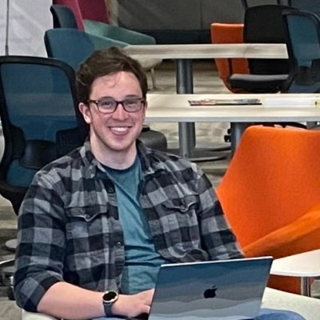

# Who are we?

We are a collection of 4th year students at the University of Ottawa. We make up a team from a number of different academic backgrounds, joined together to solve real world data analytics problems.

## Emma Falls

- 4th year Financial Math and Economics Major

## Mairi Hallman

- 4th year Statistics Student
- Strong capacity for ML

## Samantha Sellinger

- 4th year Mathematics and Computer Science

## Zachary Fagnou

- 4th year Joint Honours Mathematics and Computer Science students
- [LinkedIn](https://www.linkedin.com/in/zachary-fagnou/)