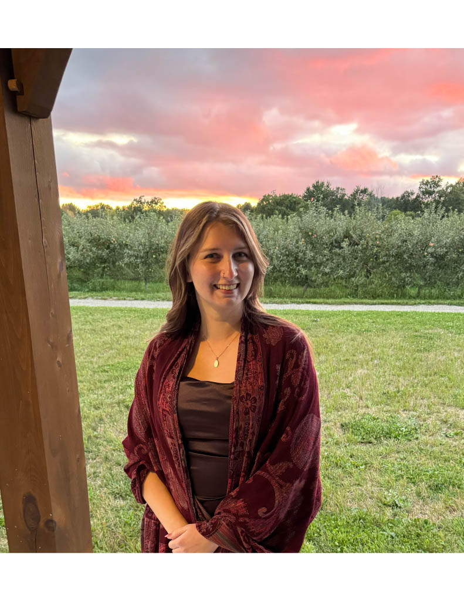
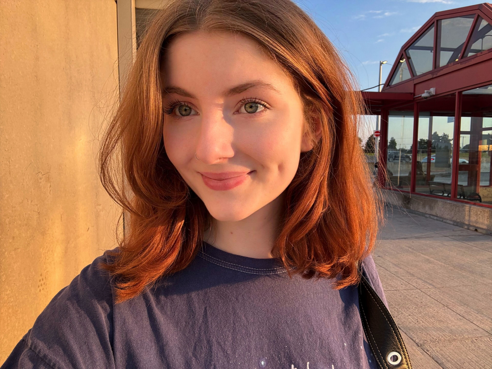
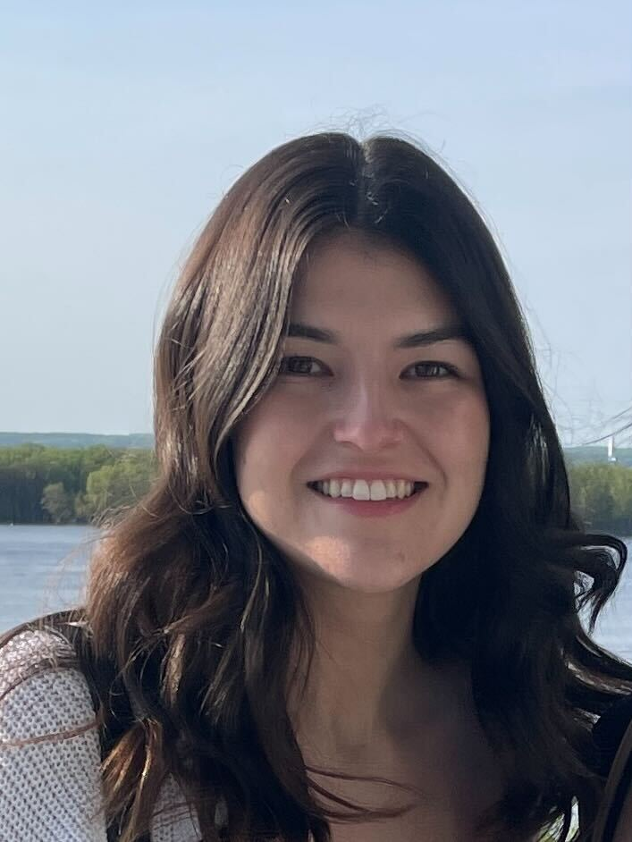
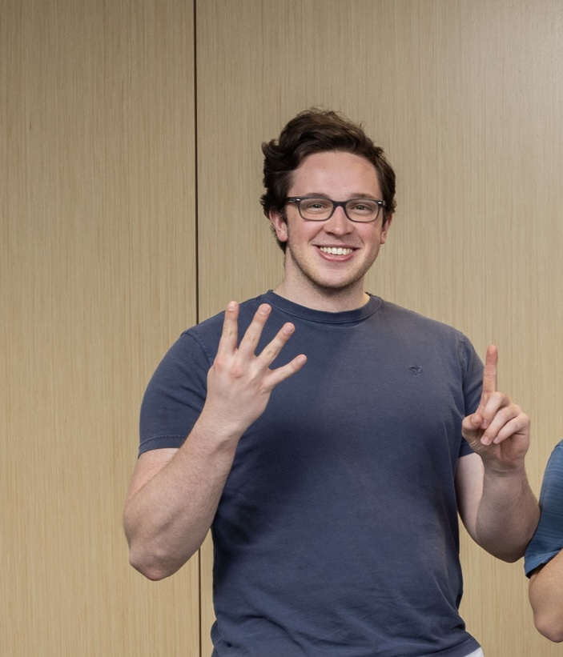

# Who are we?

We are a collection of 4th year students at the University of Ottawa. We make up a team from a number of different academic backgrounds, joined together to solve real-world data analytics problems.

## Emma Falls

- Fourth year Financial Math and Economics Major
- [LinkedIn](https://www.linkedin.com/in/emmafalls/)

## Mairi Hallman

- 4th year Statistics Student
- [LinkedIn]()

## Samantha Sellinger

- Fourth year Major in Mathematics, Minor in Computer Science for scientists
- Part-time student at Statistics Canada 
- [LinkedIn](https://www.linkedin.com/in/samantha-sellinger-6a636a2b8/?utm_source=share&utm_campaign=share_via&utm_content=profile&utm_medium=ios_app)

## Zachary Fagnou

- 4th year Joint Honours Mathematics and Computer Science student
- [LinkedIn](https://www.linkedin.com/in/zachary-fagnou/)
